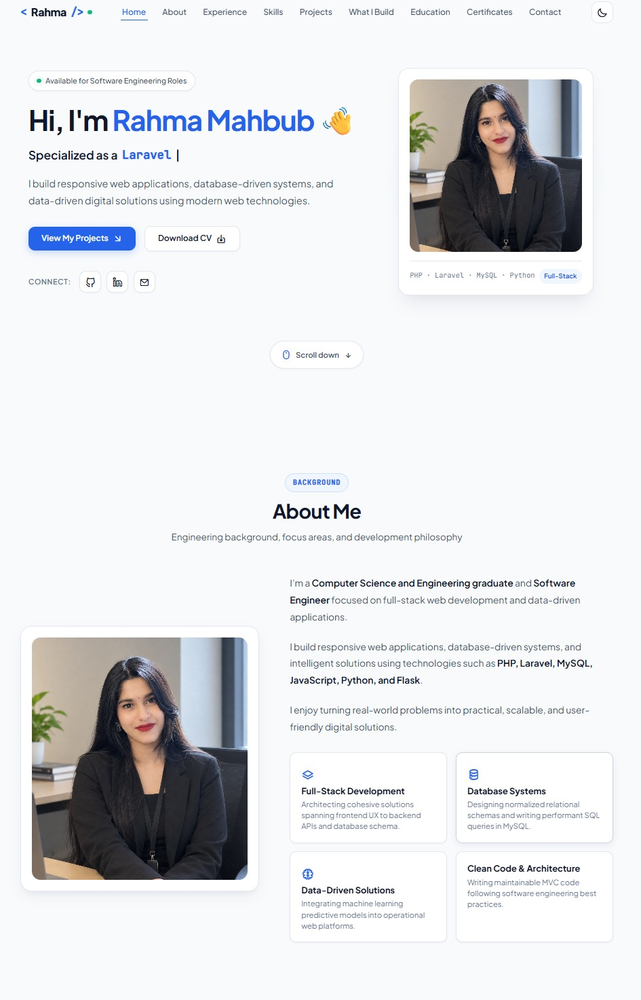

Rahma Mahbub — Personal Portfolio Website

A modern, responsive personal portfolio website designed to showcase Rahma Mahbub's skills, projects, experience, and professional profile.

✨ Features
📱 Fully responsive design for mobile, tablet, and desktop devices
🎨 Modern and clean user interface
🌙 Light and dark mode support
⚡ Smooth scrolling and interactive sections
💼 Dedicated portfolio/project showcase
👩‍💻 Skills and professional experience sections
📩 Contact section for easy communication
🚀 Optimized for a smooth and pleasant browsing experience
📐 Developed using a mobile-first approach
🌐 Compatible with modern web browsers
🛠️ Technologies Used
HTML5
CSS3
JavaScript
Bootstrap
Font Awesome / Icon Libraries

1. Clone the repository
git clone https://github.com/Rahma6026/rahmaportfolio.git
2. Open the project

Navigate to the project directory:

cd rahmaportfolio
3. Run the website

🌐 Live Website

Visit the portfolio website:

Rahma Mahbub Portfolio

Add your live portfolio URL here once it is deployed.

📸 Preview

Add a screenshot of your portfolio here:

👩‍💻 About

This portfolio website represents Rahma Mahbub's professional profile, highlighting personal projects, technical skills, experience, and contact information through a clean and responsive interface.

📄 License

This project is created for personal portfolio and professional showcase purposes.
